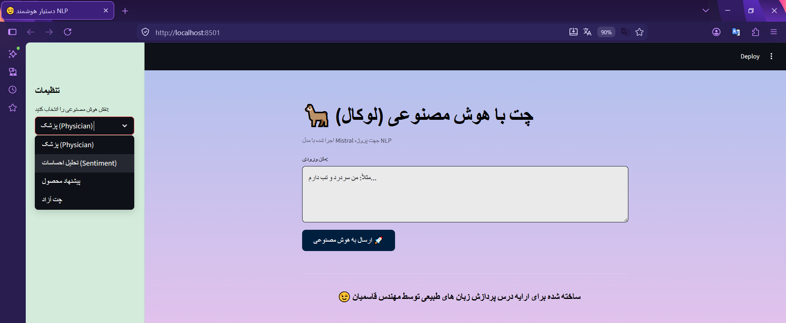

# 🦙 NLP Ollama Chat

> **A privacy-focused, bilingual AI assistant with multiple personas — powered by Ollama and Streamlit.**

[](https://www.python.org/)
[](https://streamlit.io/)
[](https://ollama.com/)
[](https://mistral.ai/)
[]()

---

## 🖼 Preview



> *A clean, bilingual Streamlit interface for chatting with a local Mistral model.*

---

## 📖 Overview

**NLP Ollama Chat** is a fully local, privacy-first chat application that brings the power of large language models to your desktop. Built with **Streamlit** for the UI and **Ollama** for running the **Mistral** model locally, it offers four distinct AI personas — from medical advice to sentiment analysis — without ever sending your data to the cloud.

This project was developed as a **mini NLP project** for an academic course presentation, demonstrating practical applications of Natural Language Processing through local inference.

> 🔒 **100% Local. 100% Private. No data leaves your machine.**

---

## 🌍 Bilingual Support (Persian & English)

The application is fully **bilingual**:

- 🇮🇷 **Persian (فارسی)** — default interface language, with full RTL support.
- 🇬🇧 **English** — switch easily by adjusting the language setting.

**You can freely type in either Persian or English** — the Mistral model understands both and responds in the same language as your input.

> 💡 Simply write your question in Persian or English — the AI will reply accordingly.

---

## ✨ Features

- 🧠 **Four AI Personas** — Physician, Sentiment Analyst, Product Recommender, Free Chat
- 🌐 **Persian & English Input** — fully bilingual
- 🎨 **Beautiful Custom UI** — background image, custom sidebar, styled components
- ⚡ **Real-time Responses** — powered by Ollama’s local inference
- 🔐 **Complete Privacy** — no external servers, no API keys
- 📚 **Educational Mini Project** — built for an NLP course demo

---

## 🛠 Tech Stack

| Technology | Purpose |
|------------|---------|
| **Python 3.9+** | Core language |
| **Streamlit** | Web UI framework |
| **Ollama** | Local LLM runtime |
| **Mistral 7B** | Language model |
| **Base64 / CSS** | Custom styling |

---

## 📋 Prerequisites

- **Python 3.9 or higher**
- **Ollama** installed and running — [Download here](https://ollama.com/download)
- **Mistral model** pulled locally

---

## 🚀 Installation

1. **Clone the repository**:

   ```bash
   git clone https://github.com/your-username/nlp-ollama-chat.git
   cd nlp-ollama-chat
Install dependencies:

bash
pip install -r requirements.txt
Ensure 11.png is in the project root.

⚙️ Setup Ollama & Mistral
bash
ollama serve
ollama pull mistral
ollama list
🎮 Usage
bash
streamlit run app.py
Open your browser at http://localhost:8501.

How to Use
Select a role from the sidebar.

Type your message in Persian or English.

Click "ارسال به هوش مصنوعی 🚀".

View the response in the styled box.

📁 Project Structure
text
nlp-ollama-chat/
├── app.py
├── 11.png
├── requirements.txt
├── README.md
├── LICENSE
├── .gitignore
└── screenshots/
    └── demo.png
🔒 Security & Privacy
No external API calls — everything runs locally.

No data collection — conversations never leave your machine.

Private repository — personal/educational use only.

⚠️ Never commit .env, API keys, or sensitive data.

📜 License
All Rights Reserved.

Copyright (c) 2025 [Your Full Name]

This project is proprietary and intended for personal and educational use only.
Unauthorized copying, distribution, or commercial use is strictly prohibited.

👨‍🏫 Author
Engineer Ahlam Ghasemian
Created for the Natural Language Processing (NLP) course presentation.

🙏 Acknowledgements
Ollama

Streamlit

Mistral AI
